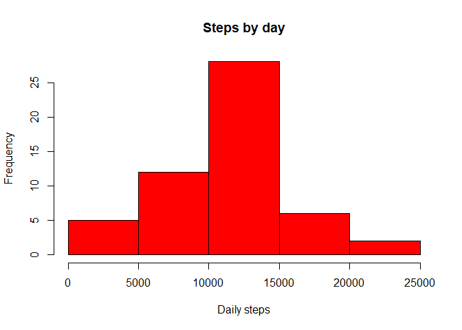
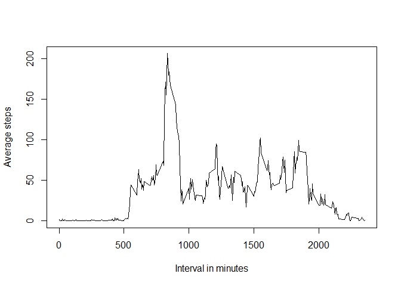
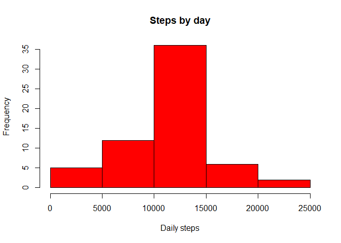
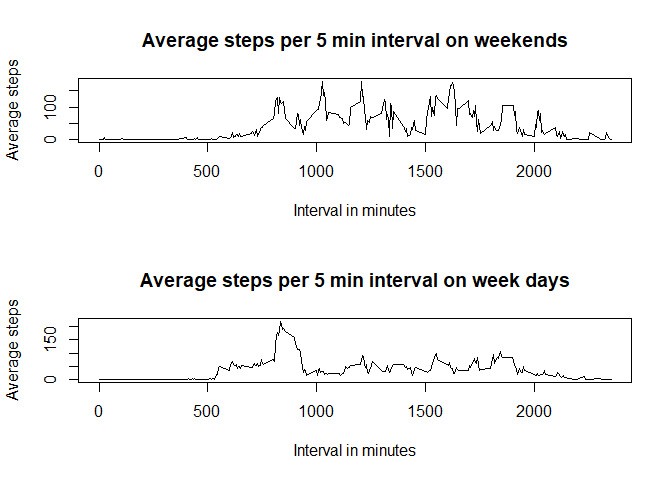

# Reproducible Research: Peer Assessment 1

## Loading and preprocessing the data

First we will unzip the file, read it as csv and look at the structure of the data.
We will convert the steps to numeric to facilitate further analysis


```r
setwd("G:/My Drive/Jota MS/R/Github/RepData_PeerAssessment1")
unzip("activity.zip")
my_data <- read.csv('activity.csv')
my_data$steps <- as.numeric(my_data$steps)
str(my_data)
```

```
## 'data.frame':	17568 obs. of  3 variables:
##  $ steps   : num  NA NA NA NA NA NA NA NA NA NA ...
##  $ date    : Factor w/ 61 levels "2012-10-01","2012-10-02",..: 1 1 1 1 1 1 1 1 1 1 ...
##  $ interval: int  0 5 10 15 20 25 30 35 40 45 ...
```

```r
head(my_data)
```

```
##   steps       date interval
## 1    NA 2012-10-01        0
## 2    NA 2012-10-01        5
## 3    NA 2012-10-01       10
## 4    NA 2012-10-01       15
## 5    NA 2012-10-01       20
## 6    NA 2012-10-01       25
```


## What is mean total number of steps taken per day?

For this part of the assignment, we will ignore the missing values in the dataset.
We will calculate the total number of steps taken per day using the aggregate function and show it with an histogram.
We will then and report the mean and median of the total number of steps taken per day, using the summary function.


```r
my_data_by_date <- aggregate(my_data$steps, by=list(date=my_data$date), FUN=sum)
colnames(my_data_by_date) <- c("date","total_steps")
#png(file = "plot1.png", bg = "transparent")
str(my_data_by_date)
```

```
## 'data.frame':	61 obs. of  2 variables:
##  $ date       : Factor w/ 61 levels "2012-10-01","2012-10-02",..: 1 2 3 4 5 6 7 8 9 10 ...
##  $ total_steps: num  NA 126 11352 12116 13294 ...
```

```r
hist(my_data_by_date$total_steps,col="red",freq=TRUE,main = "Steps by day",xlab = "Daily steps")
```

<!-- -->

```r
#dev.off()
summary(my_data_by_date)
```

```
##          date     total_steps   
##  2012-10-01: 1   Min.   :   41  
##  2012-10-02: 1   1st Qu.: 8841  
##  2012-10-03: 1   Median :10765  
##  2012-10-04: 1   Mean   :10766  
##  2012-10-05: 1   3rd Qu.:13294  
##  2012-10-06: 1   Max.   :21194  
##  (Other)   :55   NA's   :8
```

As we can see, the Mean is 10765, close to the Median (10766)

## What is the average daily activity pattern?

We will first calculate the daily average.
Then we will plot the average number of steps taken in each 5-minute interval.


```r
#Calculating daily avergage, removing NAs from calculation
daily_average <- mean(my_data_by_date$total_steps, na.rm = TRUE)
daily_average
```

```
## [1] 10766.19
```

```r
#Aggregating data by 5 min interval, using the mean function and removing NAs

my_data_by_interval <- aggregate(my_data$steps, by=list(interval=my_data$interval), FUN=mean, na.rm = TRUE)
colnames(my_data_by_interval) <- c("interval","average_steps")
#png(file = "plot2.png", bg = "transparent")
str(my_data_by_interval)
```

```
## 'data.frame':	288 obs. of  2 variables:
##  $ interval     : int  0 5 10 15 20 25 30 35 40 45 ...
##  $ average_steps: num  1.717 0.3396 0.1321 0.1509 0.0755 ...
```

```r
plot(my_data_by_interval$interval,my_data_by_interval$average_steps,type = "l",ylab="Average steps",xlab="Interval in minutes")
```

<!-- -->

```r
#dev.off()
```

As we can see in the above chart, the average interval peaks at 206 steps in the 835 interval which correspondos to 1:55PM - 2PM.

## Imputing missing values

Note that there are a number of days/intervals where there are missing valueS. The presence of missing days may introduce bias into some calculations or summaries of the data.

First we will look at the size of the problem: running a summary on the data gives us the number of NAs. 2304 missing data is quite significant considering the number of observations (more than 10%).

We will devise a strategy for filling the missing values. We will consider the average value for that 5 minutes interval.
We will merge my_data with my_data_by_interval using the merge funcion. The common key will be the interval value.
Finally the NA data are replaced by the average for that interval

We will show an histogram of this new data.


```r
#Count the number of NAs
str(my_data)
```

```
## 'data.frame':	17568 obs. of  3 variables:
##  $ steps   : num  NA NA NA NA NA NA NA NA NA NA ...
##  $ date    : Factor w/ 61 levels "2012-10-01","2012-10-02",..: 1 1 1 1 1 1 1 1 1 1 ...
##  $ interval: int  0 5 10 15 20 25 30 35 40 45 ...
```

```r
summary(my_data)
```

```
##      steps                date          interval     
##  Min.   :  0.00   2012-10-01:  288   Min.   :   0.0  
##  1st Qu.:  0.00   2012-10-02:  288   1st Qu.: 588.8  
##  Median :  0.00   2012-10-03:  288   Median :1177.5  
##  Mean   : 37.38   2012-10-04:  288   Mean   :1177.5  
##  3rd Qu.: 12.00   2012-10-05:  288   3rd Qu.:1766.2  
##  Max.   :806.00   2012-10-06:  288   Max.   :2355.0  
##  NA's   :2304     (Other)   :15840
```

```r
#Merge data frames to bring average values in
my_data_merged <- merge(my_data,my_data_by_interval,by.x = "interval",by.y = "interval")
#Replace NA values with average values
my_data_merged[is.na(my_data_merged$steps),]$steps <- my_data_merged[is.na(my_data_merged$steps),]$average_steps
#Checking NAs are gone
str(my_data_merged)
```

```
## 'data.frame':	17568 obs. of  4 variables:
##  $ interval     : int  0 0 0 0 0 0 0 0 0 0 ...
##  $ steps        : num  1.72 0 0 0 0 ...
##  $ date         : Factor w/ 61 levels "2012-10-01","2012-10-02",..: 1 54 28 37 55 46 20 47 38 56 ...
##  $ average_steps: num  1.72 1.72 1.72 1.72 1.72 ...
```

```r
summary(my_data_merged)
```

```
##     interval          steps                date       average_steps    
##  Min.   :   0.0   Min.   :  0.00   2012-10-01:  288   Min.   :  0.000  
##  1st Qu.: 588.8   1st Qu.:  0.00   2012-10-02:  288   1st Qu.:  2.486  
##  Median :1177.5   Median :  0.00   2012-10-03:  288   Median : 34.113  
##  Mean   :1177.5   Mean   : 37.38   2012-10-04:  288   Mean   : 37.383  
##  3rd Qu.:1766.2   3rd Qu.: 27.00   2012-10-05:  288   3rd Qu.: 52.835  
##  Max.   :2355.0   Max.   :806.00   2012-10-06:  288   Max.   :206.170  
##                                    (Other)   :15840
```

```r
#Looking at daily average, mean and showing histogram again
my_data_merged_by_date <- aggregate(my_data_merged$steps, by=list(date=my_data_merged$date), FUN=sum)
colnames(my_data_merged_by_date) <- c("date","total_steps")
#png(file = "plot3.png", bg = "transparent")
str(my_data_merged_by_date)
```

```
## 'data.frame':	61 obs. of  2 variables:
##  $ date       : Factor w/ 61 levels "2012-10-01","2012-10-02",..: 1 2 3 4 5 6 7 8 9 10 ...
##  $ total_steps: num  10766 126 11352 12116 13294 ...
```

```r
hist(my_data_merged_by_date$total_steps,col="red",freq=TRUE,main = "Steps by day",xlab = "Daily steps")
```

<!-- -->

```r
#dev.off()

summary(my_data_merged_by_date)
```

```
##          date     total_steps   
##  2012-10-01: 1   Min.   :   41  
##  2012-10-02: 1   1st Qu.: 9819  
##  2012-10-03: 1   Median :10766  
##  2012-10-04: 1   Mean   :10766  
##  2012-10-05: 1   3rd Qu.:12811  
##  2012-10-06: 1   Max.   :21194  
##  (Other)   :55
```

As we can see, the Mean did not change (vs the first exercise, disconsidering NAs) but the Median increased a bit (10766). There was no significant impact overall in replacing the NAs with such mean values.

## Are there differences in activity patterns between weekdays and weekends?

Are there differences in activity patterns between weekdays and weekends?
For this part the \color{red}{\verb|weekdays()|}weekdays() function may be of some help here. Use the dataset with the filled-in missing values for this part.

Create a new factor variable in the dataset with two levels - "weekday" and "weekend" indicating whether a given date is a weekday or weekend day.

Make a panel plot containing a time series plot (i.e. \color{red}{\verb|type = "l"|}type = "l") of the 5-minute interval (x-axis) and the average number of steps taken, averaged across all weekday days or weekend days (y-axis). See the README file in the GitHub repository to see an example of what this plot should look like using simulated data.


```r
#Include weekday in the data frame
my_data_merged$date <- as.character(my_data_merged$date)
my_data_merged$date <- as.Date.character(my_data_merged$date)
my_data_merged$day <- weekdays(my_data_merged$date)

#Including weekday/weekend information
#R studio running in Portuguese here ... apologies
my_data_merged$daytype <- "weekday"
```


```r
my_data_merged[my_data_merged$day == "s攼㸱bado",]$daytype <- rep("weekend", times =length(my_data_merged[my_data_merged$day == "s攼㸱bado",]$daytype))
```


```r
my_data_merged[my_data_merged$day == "domingo",]$daytype <- rep("weekend", times =length(my_data_merged[my_data_merged$day == "domingo",]$daytype))

#To compare weekend and weekdays, showing time series, we will aggregate data by interval again, for weekends and weekdays
```


```r
my_data_merged_by_interval_weekend <- aggregate(my_data_merged[my_data_merged$daytype == "weekend",]$steps, by=list(interval=my_data_merged[my_data_merged$daytype == "weekend",]$interval), FUN=mean, na.rm = TRUE)
colnames(my_data_merged_by_interval_weekend) <- c("interval","average_steps")

my_data_merged_by_interval_weekday <- aggregate(my_data_merged[my_data_merged$daytype == "weekday",]$steps, by=list(interval=my_data_merged[my_data_merged$daytype == "weekday",]$interval), FUN=mean, na.rm = TRUE)
colnames(my_data_merged_by_interval_weekday) <- c("interval","average_steps")

#And then plot the data
#png(file = "plot4.png", bg = "transparent")
par(mfrow = c(2,1))
plot(my_data_merged_by_interval_weekend$interval,my_data_merged_by_interval_weekend$average_steps,type = "l",ylab="Average steps",xlab="Interval in minutes",main ="Average steps per 5 min interval on weekends")
plot(my_data_merged_by_interval_weekday$interval,my_data_merged_by_interval_weekday$average_steps,type = "l",ylab="Average steps",xlab="Interval in minutes",main = "Average steps per 5 min interval on week days")
```

<!-- -->

```r
#dev.off()
```


